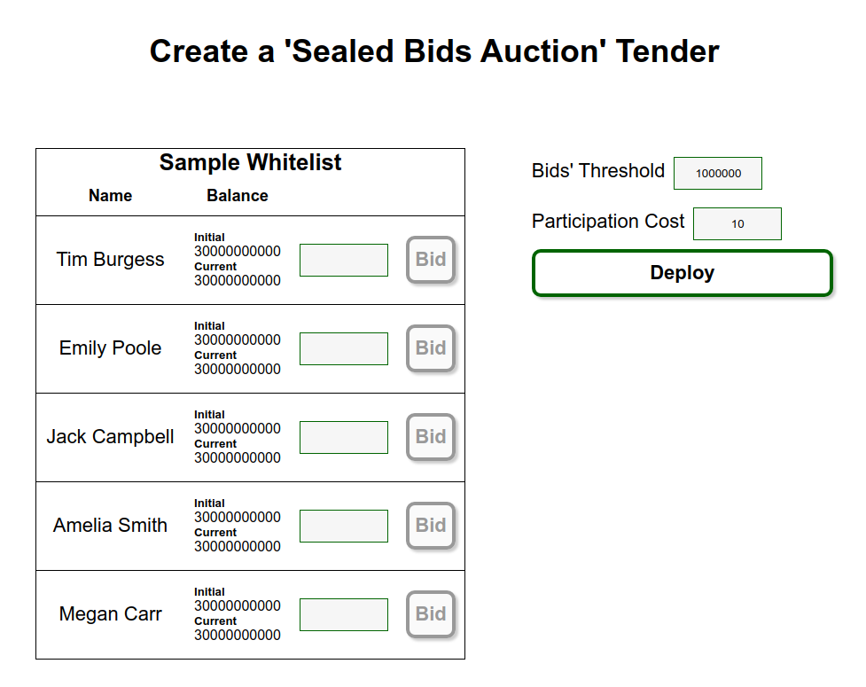
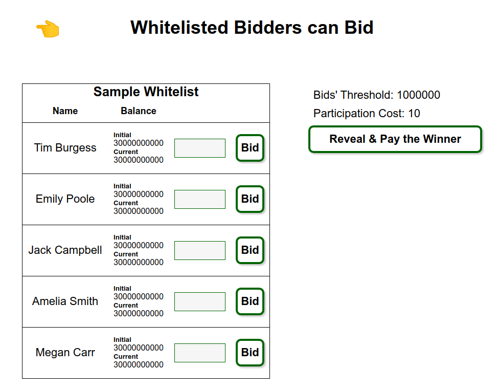
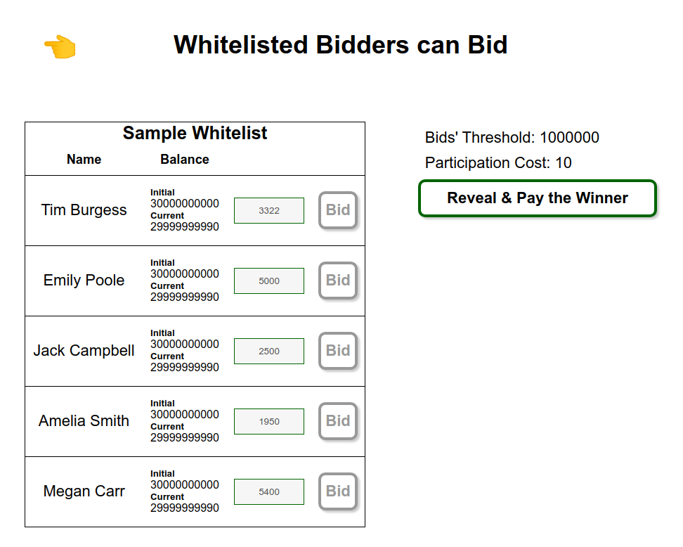
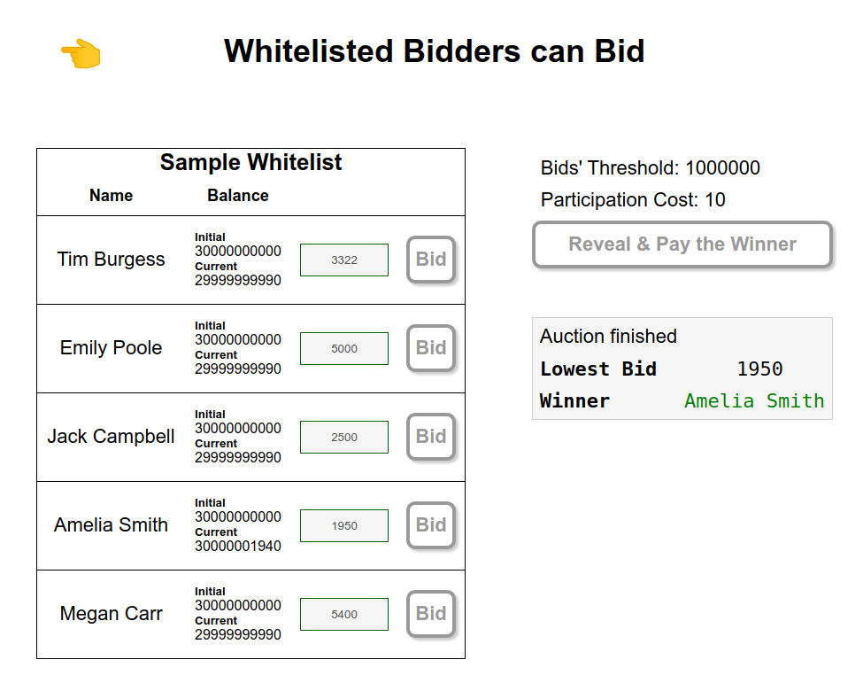

# Sealed Bid Auction PoC with SnarkyJS

Zero-knowledge Sealed Bid Auction with SnarkyJS.

This is a PoC that is meant to demonstrate how a sealed bid auction could be implemented with SnarkzJS. Final implementation would require the bidders to bid privately. But for simplification, they are now all shown on the same webpage. And more investigation and research should be done to further utilize ZK with SnarkyJS.

## Run

Execute:

```sh
npm i
npx tsc && npm run start
```

Then open: http://localhost:3000

## Execution flow

This is how it looks like when it is the first time you open the webpage:

Press `Deploy` to start interacting with the SmartContract



---

Now whitelisted bidders can bid:



---

It would look like this when some of the bidders had submitted their bids:


---

This is when all bidders had submitted their bids:



---

After revealing the auction winner:


